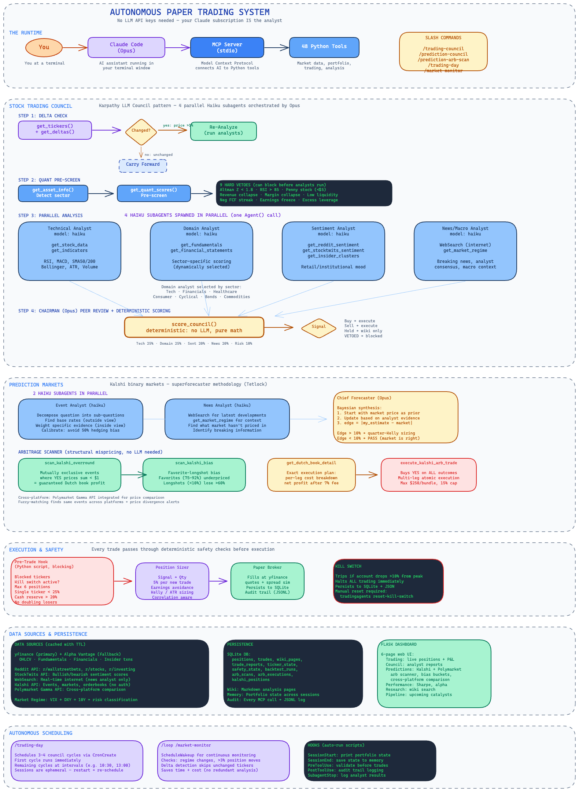

# quorum

Autonomous paper trading system powered by Claude Code. A council of specialist AI analysts runs in parallel, debates, and reaches a **quorum** — then executes trades. All through your Claude subscription, with no LLM API keys.

The architecture is inspired by [TauricResearch/TradingAgents](https://github.com/TauricResearch/TradingAgents) ([arXiv:2412.20138](https://arxiv.org/abs/2412.20138)), but quorum is a different kind of system: where the original framework orchestrates agents via LLM API calls, quorum is harnessed *entirely* through Claude Code — subagents, skills, hooks, and MCP tools — so the model running it is your Claude subscription, not a metered API.

> ⚠️ **Disclaimer** — quorum is a personal project built for educational and experimental purposes only. It trades a **simulated paper account**, not real money. Nothing here is financial, investment, or trading advice, and none of its output should be relied on for real-world decisions. It is provided **as-is, with no warranty of any kind**. If you adapt it toward real capital, you do so **entirely at your own risk**. See [LICENSE](LICENSE).

---

## How It Works



<sub>High-level overview. For the full per-component detail (every analyst's tools, the scoring formula, vetoes, debate gates), see the [detailed diagram](architecture-detailed.png).</sub>

### Key Design Decisions

- **Model tiering**: Analysts run on Haiku (fast, cheap). Chairman runs on Opus (deep reasoning). Cuts cost ~75% vs all-Opus.
- **Sector-aware analysis**: 7 domain-specific analyst skills (tech, financials, healthcare, consumer, cyclical, bonds, commodities) — each with focused metrics and prompt templates.
- **Delta-aware cycles**: `get_ticker_deltas` checks price movement, news staleness, regime shifts. Unchanged tickers carry forward prior scores.
- **Deterministic scoring**: `score_council` is code, not LLM reasoning. Quant pre-screen (Altman Z, FCF yield, regime-conditional technicals) anchors LLM scores with auditable math.
- **Pre-trade hooks**: Risk validation runs as a Claude Code hook — the model literally cannot bypass it.
- **Live intraday risk**: Circuit breakers (GREEN/YELLOW/ORANGE/RED) with auto kill switch on daily loss > 3% or VIX > 30.

---

## Quick Start

```bash
pip install .
pip install ".[mcp]"
quorum health        # verify everything works
```

Then in Claude Code:
```
/trading-council            # 4 parallel analyst subagents (recommended)
/trading-day                # full day: immediate cycle + scheduled follow-ups
/loop /trading-council      # continuous 30-min delta-aware cycles
/scalp-planner              # aggressive short-term day-trading on today's movers
/market-monitor             # background regime/position monitoring (use with /loop)
```

---

## Claude Code Harness

### Skills (20+)

| Skill | Model | Purpose |
|-------|-------|---------|
| `/trading-council` | Opus | Full council: delta check -> 4 parallel analysts -> score -> execute |
| `/scalp-planner` | Sonnet | Aggressive short-term momentum plan on today's dynamic movers |
| `/scalp-executor` | Sonnet | Fast mechanical execution of the scalp plan (tight stops) |
| `/trading-day` | Opus | Schedule a full trading day (CronCreate) |
| `/market-monitor` | Opus | Background regime/position monitoring (use with /loop) |
| `/trading-cycle` | Opus | Simpler single-agent mode |
| `/backtest` | Opus | Run backtests in isolated git worktrees |
| `analyst-technical` | Haiku | Price action, RSI, MACD, SMA. **Restricted tools** |
| `analyst-sector-tech` | Haiku | SaaS metrics, R&D, TAM, AI exposure |
| `analyst-sector-financials` | Haiku | NIM, credit quality, CET1, ROE |
| `analyst-sector-healthcare` | Haiku | Drug pipeline, FDA catalysts, patent cliffs |
| `analyst-sector-consumer` | Haiku | Brand moat, pricing power, same-store sales |
| `analyst-sector-cyclical` | Haiku | Capex cycles, commodity exposure, order backlogs |
| `analyst-bonds` | Haiku | Yield curve, duration, credit spreads |
| `analyst-commodities` | Haiku | Supply/demand, contango, geopolitical risk |
| `analyst-sentiment` | Haiku | StockTwits, Reddit, insider activity |
| `analyst-news` | Haiku | Real-time web search + regime |
| `analyst-fundamental` | Haiku | Generic valuation fallback |

### Hooks

| Event | Hook | What It Does |
|-------|------|-------------|
| `PreToolUse` | `pre_trade_validate.py` | Blocks trades violating risk rules |
| `PostToolUse` | `post_tool_audit.py` | Logs every MCP tool call to audit trail |
| `SubagentStop` | `post_tool_audit.py` | Logs analyst subagent completions |
| `SessionStart` | `session_start.py` | Auto-injects portfolio state + regime |
| `Stop` | `session_end.py` | Auto-saves portfolio state to memory |

### MCP Tools (38)

| Category | Count | Tools |
|----------|-------|-------|
| Data | 13 | get_stock_data, get_indicators, get_fundamentals, get_financial_statements, get_news, get_global_news, get_reddit_sentiment, get_stocktwits_sentiment, get_insider_transactions, get_insider_clusters, get_market_regime, get_sector_rotation, get_earnings_calendar |
| Portfolio | 5 | get_portfolio, get_trades, get_watchlist, add_to_watchlist, remove_from_watchlist |
| Execution | 1 | execute_paper_trade |
| Safety | 2 | kill_switch, get_rules |
| Council | 6 | get_autonomous_tickers, get_full_ticker_data, save_analysis_to_wiki, save_trade_report, get_trade_reports, score_council |
| State & Cache | 4 | get_ticker_state, get_ticker_deltas, get_cache_stats, get_asset_info |
| Quant & Risk | 3 | get_quant_scores, get_portfolio_risk, get_live_risk |
| Maintenance | 4 | prune_wiki, get_analytics_summary, search_wiki, get_wiki_page |

### Automation

Runs fully unattended via macOS launchd + `claude -p` (subscription, not API):

| Time | Cycle |
|------|-------|
| 9:30 AM | Market open: council |
| 1:30 PM | Midday rebalance |
| 3:30 PM | Late afternoon |
| 4:15 PM | EOD report + memory update |

Each cycle is independent — state persists via MCP (SQLite + wiki + memory files). Logs: `~/.quorum/logs/trading-YYYY-MM-DD.log`.

**Run it on demand:** `quorum pipeline` runs the whole flow front-to-back *regardless* of market hours / trading day, then pushes a status notification via [ntfy.sh](https://ntfy.sh) (set `QUORUM_NTFY_TOPIC` in `.env`). Use `quorum pipeline --dry-run` to test the plumbing without trading.

---

## Architecture

```
quorum/
  mcp/             — MCP server (50 tools)
  council/         — Council skills + 11 analyst prompts (4 universal + 7 domain)
  dataflows/       — Market data with TTL caching (yfinance, Reddit, StockTwits, regime, arb scanner)
  execution/       — Paper broker, safety (live risk + circuit breakers), contracts, position sizer, analytics
  quant/           — Deterministic scoring (14 files): Altman Z, FCF yield, technicals, 9 sector scorers, vetoes
  backtest/        — Quant score replay: historical IC computation, signal validation
  api/             — Flask JSON API backend (14 /api/v1 endpoints) that the Electron desktop app reads from
  wiki/            — Knowledge base (run pages, digests, ticker summaries)
```

---

## Desktop app

Visualization is a native **Electron desktop app** (`desktop/`, React + Tailwind). It auto-starts the Python JSON API backend (`quorum.api`, served on `127.0.0.1:5050/api/v1/`) and renders everything from it — there is no separate browser dashboard.

```bash
cd desktop && npm install && npm run dev   # launches the desktop app (spawns the API backend for you)
```

To run just the API backend on its own (e.g. for debugging), use `quorum` with no subcommand.

Views: **Portfolio** (positions, regime, live-risk status GREEN/YELLOW/ORANGE/RED), **Council** (analyst scores, deep dive, reports), **Performance** (Sharpe/Sortino/Calmar, profit factor, equity curve), **Research** (wiki, reports, digest), and **Pipeline** (cycle timeline, ticker deltas, decision DAG).

---

## Safety

1. **PreToolUse hook** blocks trades violating: max positions, ticker concentration (25%), cash reserve (20%), blocked tickers, kill switch
2. **`score_council` vetoes**: fundamental collapse, unanimous bearish, 2-2 split + 12 quant hard vetoes (Altman Z, FCF streak, RSI extreme, penny stock, etc.)
3. **Live intraday risk** (`get_live_risk`): circuit breakers with tiered response — YELLOW (no new buys), ORANGE (sell-only), RED (auto kill switch). Monitors daily P&L, intraday drawdown, ATR stop distances, VIX spikes.
4. **Kill switch** halts all trading — persists across restarts until manually reset
5. **`rules.json`** blocks specific tickers (e.g. employer stock)
6. **Audit trail** logs every tool call to `~/.quorum/audit/tool_calls.jsonl`
7. **Spread/slippage model** simulates realistic fills (feature-flagged)
8. **Futures**: notional exposure tracking, max leverage (3.0x), margin checks, contract expiry warnings

> **Live trading**: the default and intended mode is a **simulated paper account**. A Schwab broker integration (`quorum/execution/broker/schwab_client.py`) exists and *can* place real orders if you supply real API credentials and switch execution mode — this path is **unsupported, untested for production, and entirely at your own risk**. Don't point this at real money.

---

## Quantitative Scoring

The quant layer provides deterministic, auditable scores that anchor LLM analysis:

| Scorer | Assets | Key Metrics |
|--------|--------|-------------|
| `fundamental.py` | All equities | Altman Z, FCF yield, PE, PEG, margins, ROE |
| `tech_sector.py` | Tech stocks | Rule of 40, R&D intensity, gross margin |
| `financials.py` | Banks | NIM, P/TBV, provision trend, efficiency ratio |
| `healthcare.py` | Biotech/pharma | R&D growth, cash runway, margin trajectory |
| `consumer.py` | Consumer/REITs | Pricing power, P/FFO, dividend coverage |
| `cyclical.py` | Energy/industrial | Capex/revenue, margin cyclicality, D/E |
| `bond_etf.py` | Bond ETFs | Duration x yield direction x regime x credit tier |
| `commodity_etf.py` | Commodity ETFs | Trend vs SMA200, DXY impact, commodity type |
| `futures_score.py` | Futures | Vol percentile, DTE penalty, term structure proxy |
| `technical.py` | All | RSI, MACD, SMA, Bollinger, volume — regime-conditional thresholds |

**Trade quality metrics**: Profit Factor, Expectancy, SQN (Van Tharp), Sharpe, Sortino, Calmar, VaR, CVaR, alpha/beta.

**Backtesting**: `replay_quant_scores()` replays technical scores over historical dates, computes IC (Information Coefficient) vs actual forward returns.

---

## Configuration

`quorum/default_config.py`, overridable via `QUORUM_*` env vars:

```bash
QUORUM_PAPER_BALANCE=5000
QUORUM_MAX_DRAWDOWN_PCT=0.10
QUORUM_MAX_POSITION_PCT=0.25
QUORUM_MAX_SINGLE_TICKER_PCT=0.25
QUORUM_MAX_OPEN_POSITIONS=6
```

---

## Testing

```bash
pytest tests/ -m unit    # 136 tests
```

---

## Citation

```
@misc{xiao2025tradingagentsmultiagentsllmfinancial,
      title={TradingAgents: Multi-Agents LLM Financial Trading Framework}, 
      author={Yijia Xiao and Edward Sun and Di Luo and Wei Wang},
      year={2025},
      eprint={2412.20138},
      archivePrefix={arXiv},
      primaryClass={q-fin.TR},
      url={https://arxiv.org/abs/2412.20138}, 
}
```
