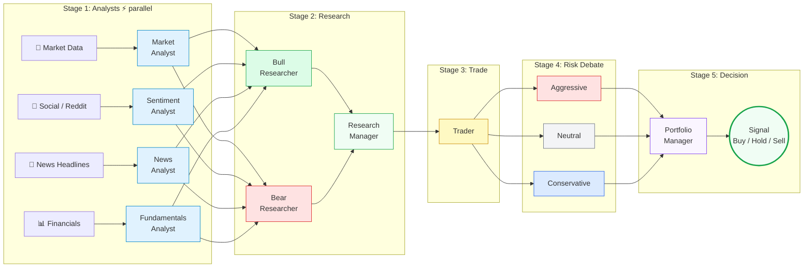
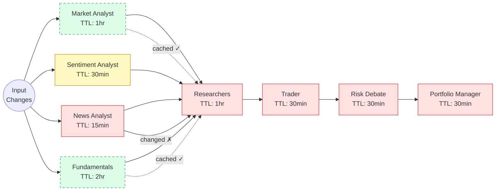
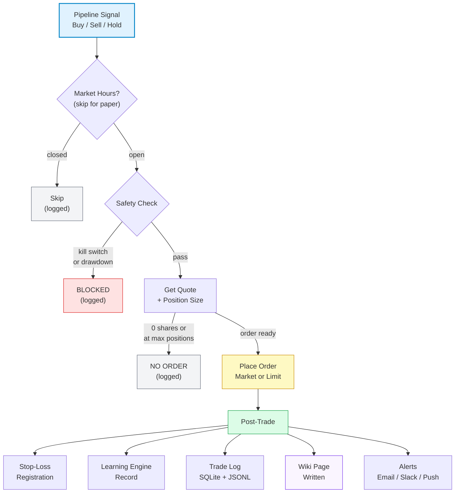

# TradingAgents

Multi-agent LLM trading framework. Specialized agents (analysts, researchers, traders, risk managers) collaboratively analyze markets and execute trades. Supports paper trading, live Schwab execution, autonomous scheduling, and a web dashboard.

Based on [TauricResearch/TradingAgents](https://github.com/TauricResearch/TradingAgents) ([arXiv:2412.20138](https://arxiv.org/abs/2412.20138)).

---

## Pipeline



### Computation Graph Caching

Caches node outputs in a DAG. When inputs haven't changed, cached outputs are reused — skipping the LLM call entirely. On a 10-ticker watchlist with hourly re-checks, this cuts LLM spending by 60-80%.



### Execution Flow



---

## Quick Start

```bash
pip install .
pip install ".[mcp]"       # for MCP server (Claude subscription mode)
tradingagents               # opens dashboard
tradingagents cli           # interactive analysis CLI
```

---

## Two Ways to Use

### Option A: MCP Server (use your Claude subscription — no API costs)

Claude Desktop or Claude Code acts as the analyst. The MCP server provides all market data tools, and Claude does the reasoning. Zero API cost beyond your existing subscription. Works for both manual analysis AND autonomous trading.

**One-command setup:**

```bash
./setup_mcp.sh
```

This configures Claude Desktop + Claude Code globally, installs the MCP dependency, creates `~/.tradingagents/tickers.txt`, and installs the trading skill.

**Or manual setup:**

```bash
pip install ".[mcp]"
```

Add to Claude Desktop config (`~/Library/Application Support/Claude/claude_desktop_config.json`):

```json
{
  "mcpServers": {
    "tradingagents": {
      "command": "python",
      "args": ["-m", "tradingagents.mcp.server"],
      "cwd": "/path/to/TradingAgents"
    }
  }
}
```

Or for Claude Code, add to `~/.claude/settings.json` (global):

```json
{
  "mcpServers": {
    "tradingagents": {
      "command": "python",
      "args": ["-m", "tradingagents.mcp.server"],
      "cwd": "/path/to/TradingAgents"
    }
  }
}
```

**Manual analysis:**
```
"Analyze NVDA — check technicals, fundamentals, news, and sentiment"
"What's the current market regime?"
"Show me my portfolio and recent trades"
"Are there any insider clusters in MSFT?"
```

**Autonomous trading (Claude is the analyst):**
```
"Run my autonomous trading cycle — get my tickers, analyze each one, and execute trades"
```

This tells Claude to:
1. Call `get_autonomous_tickers` — reads your `~/.tradingagents/tickers.txt` and shows current portfolio
2. For each ticker, call `get_full_ticker_data` — fetches price data, technicals, fundamentals, news, sentiment, insiders, earnings in one call
3. Claude analyzes the data and decides Buy/Sell/Hold
4. Call `execute_paper_trade` to act on the decision
5. Call `save_analysis_to_wiki` to record it

All results stream into the dashboard automatically.

To make this run on a schedule, use Claude Code's `/schedule` command or set up a cron trigger.

**How do you know it's using your subscription and NOT the API?**

The MCP tools are split into two categories:

| Tool | Who does the thinking? | Cost |
|------|----------------------|------|
| `get_full_ticker_data` | **You (Claude)** analyze the data | Free (subscription) |
| `get_autonomous_tickers` | **You (Claude)** decide what to trade | Free (subscription) |
| `execute_paper_trade` | Just places an order, no LLM | Free |
| `save_trade_report` / `save_analysis_to_wiki` | Just writes data | Free |
| All other data tools | Just fetch data, no LLM | Free |
| `run_multi_agent_pipeline` | Runs 10+ LLM agents via **API** | **Costs money** |

The rule is simple: if Claude is the one reading data and making decisions, it's your subscription. The only tool that costs money is `run_multi_agent_pipeline` — and it's clearly labeled with a warning. You'd never call it in MCP mode.


---

## Ticker File

The autonomous scheduler reads tickers from `~/.tradingagents/tickers.txt` — one ticker per line, `#` comments supported. Edit this file to manage your watchlist:

```
# ~/.tradingagents/tickers.txt
AAPL
MSFT
NVDA
GOOGL
TSLA
JPM
GS
```

Tickers from this file are merged with any watchlist configured in the dashboard or CLI. Changes are picked up on the next scheduler refresh — no restart needed.

The AI can also add tickers via the discovery scanner (`tradingagents scan`) or the MCP `add_to_watchlist` tool.

---

## Dashboard

Reflex-based web dashboard for monitoring trades, positions, and analytics.

```bash
cd tradingagents/dashboard_v2
reflex run
```

**8 pages:**

| Page | What it shows |
|------|---------------|
| Overview | Portfolio KPIs, equity curve, positions |
| Activity | Trade log, **pre/post trade reports** with full analysis, signal distribution, CSV export |
| History | Trade timeline with detail modals |
| Analytics | Sharpe, Sortino, drawdown, alpha, **market regime** (VIX/DXY/yields) |
| Intelligence | Congressional trades, convergence signals, **sector rotation**, discovery scanner |
| Wiki | Run pages, daily digests, ticker summaries from the trading knowledge base |
| Backtest | Run backtests, view equity curves and trade lists |
| System | Kill switch, autonomous trading, pipeline config, risk settings |

---

## Autonomous Trading Setup

1. **Edit your ticker file:**
   ```
   # ~/.tradingagents/tickers.txt
   AAPL
   MSFT
   NVDA
   GOOGL
   ```

2. **Configure MCP** (see setup above) or run `./setup_mcp.sh`.

3. **Open the dashboard** in one terminal:
   ```bash
   tradingagents
   ```

4. **Run the trading council** in Claude Code or Claude Desktop:
   ```
   /trading-council
   ```
   Or just say: "Run my autonomous trading cycle"

5. **What happens:**
   - Claude reads your tickers and portfolio state
   - 4 analyst subagents spawn in parallel (technical, fundamental, sentiment, news)
   - News analyst searches the web for real-time info (not stale yfinance)
   - Deterministic `score_council` tool computes weighted signal with veto logic
   - Pre-trade validation gate checks risk rules before execution
   - Paper trades execute, reports saved to wiki, dashboard updates live

6. **Schedule it:** Use Claude Code's `/schedule` for recurring runs.

---

## Trading Wiki

Every pipeline run writes a markdown page to `~/.tradingagents/wiki/`. The wiki accumulates over time and feeds context back into future analyses.

```
~/.tradingagents/wiki/
  runs/2026-05-21/NVDA.md     # full analysis: all reports, debates, decision
  daily/2026-05-21.md          # signal counts, regime stamp, conflicts
  tickers/NVDA.md              # rolling stats, win rate, narrative timeline
  regimes/risk_on.md           # which signals worked in this regime
  reports/2026-05.md           # monthly report (generated interactively)
```

**Generate a report:**
```bash
tradingagents wiki report 2026-05
```

**Search past analyses:**
```bash
tradingagents wiki search NVDA
```

The Portfolio Manager agent automatically receives relevant past wiki pages as context, including overexposure warnings when too many correlated positions are open.

---

## CLI Commands

```bash
tradingagents                                    # open dashboard (default)
tradingagents wiki search <query>                # search wiki
tradingagents wiki show <path>                   # view wiki page
tradingagents wiki digest [date]                 # generate daily digest
tradingagents wiki report <period>               # generate monthly/quarterly report
tradingagents regime                             # current market regime
tradingagents mcp-server                         # start MCP server
tradingagents scan --mode advisory               # discovery scanner
tradingagents politicians --days 45              # congressional trades
tradingagents db-status                          # SQLite health check
tradingagents reset-kill-switch                  # re-enable trading
```

All trading is done through Claude Code or Claude Desktop via MCP tools — not the CLI.

---

## Configuration

Settings in `tradingagents/default_config.py`, overridable via `TRADINGAGENTS_*` env vars:

```bash
TRADINGAGENTS_PAPER_BALANCE=100000        # starting paper balance
TRADINGAGENTS_MAX_DRAWDOWN_PCT=0.10       # kill switch threshold
TRADINGAGENTS_MAX_POSITION_PCT=0.05       # 5% per new trade
TRADINGAGENTS_MAX_SINGLE_TICKER_PCT=0.25  # 25% max in one ticker
TRADINGAGENTS_MAX_OPEN_POSITIONS=6
TRADINGAGENTS_WIKI_ENABLED=true
```

---

## Persistence

| Store | Path | Purpose |
|-------|------|---------|
| SQLite DB | `~/.tradingagents/tradingagents.db` | Positions, trades, watchlist, safety, config, wiki index, backtest results |
| Ticker file | `~/.tradingagents/tickers.txt` | Autonomous watchlist (one per line) |
| Wiki | `~/.tradingagents/wiki/` | Analysis pages, digests, ticker summaries, regime pages, reports |
| Memory log | `~/.tradingagents/memory/trading_memory.md` | Decision reflections + alpha tracking |
| Learning | `~/.tradingagents/learning.json` | RL signal/ticker weights |

---

---

## Citation

```
@misc{xiao2025tradingagentsmultiagentsllmfinancial,
      title={TradingAgents: Multi-Agents LLM Financial Trading Framework}, 
      author={Yijia Xiao and Edward Sun and Di Luo and Wei Wang},
      year={2025},
      eprint={2412.20138},
      archivePrefix={arXiv},
      primaryClass={q-fin.TR},
      url={https://arxiv.org/abs/2412.20138}, 
}
```
