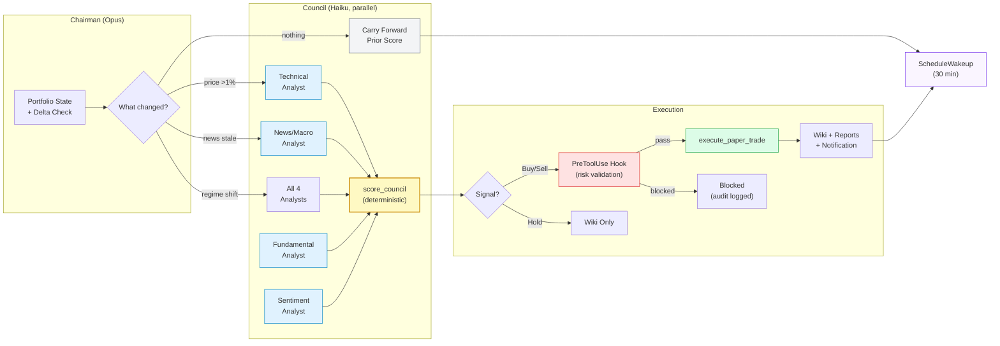

# TradingAgents

Autonomous paper trading system powered by Claude Code. Four specialist AI analysts run in parallel, debate, and execute trades — all through your Claude subscription. No API keys needed.

Based on [TauricResearch/TradingAgents](https://github.com/TauricResearch/TradingAgents) ([arXiv:2412.20138](https://arxiv.org/abs/2412.20138)).

---

## How It Works



### Key Design Decisions

- **Model tiering**: Analysts run on Haiku (fast, cheap). Chairman runs on Opus (deep reasoning). Cuts cost ~75% vs all-Opus.
- **Delta-aware cycles**: `get_ticker_deltas` checks price movement, news staleness, regime shifts. Unchanged tickers carry forward prior scores — no wasted subagent spawns.
- **Deterministic scoring**: `score_council` is code, not LLM reasoning. Hard-coded veto conditions (fundamental collapse, 2-2 split) prevent emotional overrides.
- **Pre-trade hooks**: Risk validation runs as a Claude Code hook — the model literally cannot bypass it.

---

## Quick Start

```bash
pip install .
pip install ".[mcp]"
tradingagents health        # verify everything works
```

Then in Claude Code:
```
/trading-day                # full day: immediate cycle + 30-min loop until close
/trading-council            # single council cycle
/loop /trading-council      # continuous 30-min delta-aware cycles
```

---

## Claude Code Harness

The system is built on Claude Code's native capabilities — not custom infrastructure.

### Skills (8)

| Skill | Model | Purpose |
|-------|-------|---------|
| `/trading-council` | Opus (chairman) | Full council: delta check → 4 parallel analysts → score → execute |
| `/trading-cycle` | Opus | Simpler single-agent mode |
| `/trading-day` | Opus | Schedule a full trading day (CronCreate) |
| `/market-monitor` | Opus | Background regime/position monitoring (use with /loop) |
| `analyst-technical` | Haiku | Price action, RSI, MACD, SMA. **Restricted to get_stock_data + get_indicators** |
| `analyst-fundamental` | Haiku | PE, margins, FCF, earnings. **Restricted to get_fundamentals + get_financial_statements** |
| `analyst-sentiment` | Haiku | StockTwits, Reddit, insider activity. **Restricted to sentiment tools** |
| `analyst-news` | Haiku | Real-time web search + regime. **Restricted to WebSearch + get_market_regime** |

### Hooks

| Event | Hook | What It Does |
|-------|------|-------------|
| `PreToolUse` | `pre_trade_validate.py` | Blocks trades that violate risk rules (positions, concentration, cash reserve, kill switch) |
| `PostToolUse` | `post_tool_audit.py` | Logs every MCP tool call to `~/.tradingagents/audit/tool_calls.jsonl` |
| `SubagentStop` | `post_tool_audit.py` | Logs analyst subagent completions |

### MCP Tools (34)

Data (13): get_stock_data, get_indicators, get_fundamentals, get_financial_statements, get_news, get_global_news, get_reddit_sentiment, get_stocktwits_sentiment, get_insider_transactions, get_insider_clusters, get_market_regime, get_sector_rotation, get_earnings_calendar

Portfolio (5): get_portfolio, get_trades, get_watchlist, add_to_watchlist, remove_from_watchlist

Execution (1): execute_paper_trade

Safety (2): kill_switch, get_rules

Council (6): get_autonomous_tickers, get_full_ticker_data, save_analysis_to_wiki, save_trade_report, get_trade_reports, score_council

State & Cache (3): get_ticker_state, get_ticker_deltas, get_cache_stats

Wiki (4): search_wiki, get_wiki_page, prune_wiki, get_analytics_summary

### Data Caching (TTL per category)

| Category | TTL | Why |
|----------|-----|-----|
| Price / Technicals | 60s | Changes every minute |
| Regime (VIX/DXY) | 5 min | Intraday macro shifts |
| Sentiment | 15 min | StockTwits shifts frequently |
| News | 1 hour | Headlines change hourly |
| Sector Rotation | 1 hour | Sector ETF returns |
| Fundamentals | 24 hours | PE/margins change quarterly |
| Insider Activity | 24 hours | Daily filings at most |
| Earnings Calendar | 24 hours | Dates change rarely |

### Automation

- **macOS launchd agent** fires at 9:30 AM EDT every weekday
- Starts Claude Code → runs `/loop /trading-council`
- Loop self-paces every 30 min via `ScheduleWakeup`
- At 4 PM market close, loop stops automatically
- Config: `~/Library/LaunchAgents/com.tradingagents.daily.plist`

---

## Architecture

```
.
├── .mcp.json                          # MCP server config (Claude Code reads this)
├── .claude/
│   ├── settings.json                  # Hooks, permissions, env vars
│   ├── hooks/
│   │   ├── pre_trade_validate.py      # Risk gate (blocking)
│   │   └── post_tool_audit.py         # Audit trail (logging)
│   └── skills/
│       ├── trading-council/SKILL.md   # Main council skill
│       ├── trading-day/SKILL.md       # Full-day scheduling
│       ├── trading-cycle/SKILL.md     # Single-agent mode
│       ├── market-monitor/SKILL.md    # Background monitoring
│       ├── analyst-technical/SKILL.md # Haiku + allowed-tools enforced
│       ├── analyst-fundamental/SKILL.md
│       ├── analyst-sentiment/SKILL.md
│       └── analyst-news/SKILL.md
├── tradingagents/
│   ├── mcp/server.py                  # 34 MCP tools
│   ├── council/
│   │   ├── compact_summary.py         # Delta detection + compact summaries
│   │   └── prompts/                   # Analyst prompt templates
│   ├── dataflows/
│   │   ├── cache.py                   # TTL caching (cached_config decorator)
│   │   ├── y_finance.py               # Price, fundamentals, financials
│   │   ├── regime.py                  # VIX/DXY/yield regime detector
│   │   ├── sector_rotation.py         # Sector ETF relative strength
│   │   ├── insider_clustering.py      # Insider transaction clusters
│   │   ├── earnings_calendar.py       # Earnings date proximity
│   │   ├── reddit.py                  # Reddit sentiment
│   │   └── stocktwits.py              # StockTwits sentiment
│   ├── execution/
│   │   ├── broker/paper_client.py     # Paper broker + spread/slippage model
│   │   ├── executor.py                # Trade execution engine
│   │   ├── position_sizer.py          # Kelly criterion, correlation-aware
│   │   ├── safety.py                  # Kill switch, drawdown monitor
│   │   ├── db.py                      # SQLite schema + ticker_state helpers
│   │   └── analytics.py               # Sharpe, Sortino, alpha, drawdown
│   ├── wiki/                          # Knowledge base writer
│   └── dashboard_v3/                  # Flask + Tailwind web dashboard (5 pages)
├── scripts/
│   └── start-trading-day.sh           # Auto-start script (launchd)
└── tests/
```

---

## Dashboard

```bash
tradingagents                          # launches dashboard on http://127.0.0.1:5050
```

5 pages: Trading (KPIs, positions, regime, activity), Council (scores, deep dive, reports), Performance (equity curve, Sharpe, win rates, slippage), Research (wiki browser, trade reports, daily digest), Pipeline (cycles, deltas, DAG, cache, sectors, insider clusters).

---

## Safety

1. **PreToolUse hook** blocks trades violating: max positions, ticker concentration (25%), cash reserve (10%), blocked tickers, kill switch
2. **`score_council` vetoes**: fundamental score 1 = no buys, all analysts <=2 = forced sell, 2-2 split = forced hold
3. **Kill switch** halts all trading via `kill_switch` tool or `tradingagents reset-kill-switch`
4. **`rules.json`** blocks specific tickers (e.g. employer stock)
5. **Audit trail** logs every tool call to `~/.tradingagents/audit/tool_calls.jsonl`
6. **Spread/slippage model** simulates realistic fills (feature-flagged)

---

## Configuration

`tradingagents/default_config.py`, overridable via `TRADINGAGENTS_*` env vars:

```bash
TRADINGAGENTS_PAPER_BALANCE=5000
TRADINGAGENTS_MAX_DRAWDOWN_PCT=0.10
TRADINGAGENTS_MAX_POSITION_PCT=0.25
TRADINGAGENTS_MAX_SINGLE_TICKER_PCT=0.25
TRADINGAGENTS_MAX_OPEN_POSITIONS=6
```

---

## Citation

```
@misc{xiao2025tradingagentsmultiagentsllmfinancial,
      title={TradingAgents: Multi-Agents LLM Financial Trading Framework}, 
      author={Yijia Xiao and Edward Sun and Di Luo and Wei Wang},
      year={2025},
      eprint={2412.20138},
      archivePrefix={arXiv},
      primaryClass={q-fin.TR},
      url={https://arxiv.org/abs/2412.20138}, 
}
```
